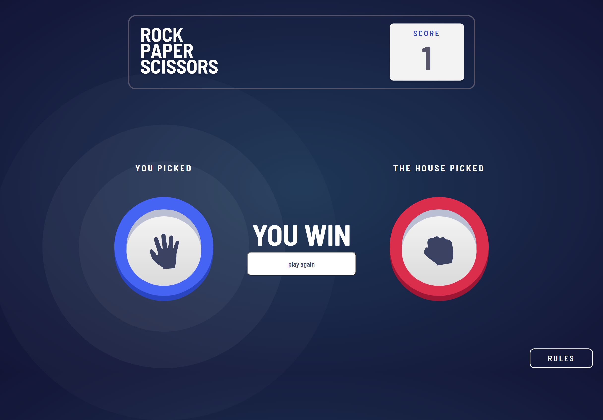

# Rock, Paper, Scissors WebApp

This is a solution to the [Rock, Paper, Scissors challenge on Frontend Mentor](https://www.frontendmentor.io/challenges/rock-paper-scissors-game-pTgwgvgH). Frontend Mentor challenges help you improve your coding skills by building realistic projects. 

## Table of contents

- [Rock, Paper, Scissors WebApp](#rock-paper-scissors-webapp)
  - [Table of contents](#table-of-contents)
  - [Overview](#overview)
    - [The challenge](#the-challenge)
    - [Screenshot](#screenshot)
      - [1. Home page](#1-home-page)
      - [2. Result page](#2-result-page)
      - [3. Rules modal](#3-rules-modal)
    - [Links](#links)
  - [My process](#my-process)
    - [Built with](#built-with)
  - [Author](#author)
  - [Contributing](#contributing)
  - [Show Your Support](#show-your-support)

## Overview

### The challenge

Users should be able to:

- View the optimal layout for the game depending on their device's screen size
- Play Rock, Paper, Scissors against the computer
- Maintain the state of the score after refreshing the browser _(optional)_
- **Bonus**: Play Rock, Paper, Scissors, Lizard, Spock against the computer _(optional)_

### Screenshot
#### 1. Home page

#### 2. Result page

#### 3. Rules modal

### Links

- Solution URL: [here](https://github.com/Slimani-CE/rock-paper-scissors-webapp)
- Live Site URL: [here](https://slimani-ce.github.io/rock-paper-scissors-webapp)

## My process

### Built with

- Semantic HTML5 markup
- CSS custom properties
- Flexbox
- CSS Grid

## Author

- Website - [https://slimani-ce.github.io/](https://slimani-ce.github.io/)
- Frontend Mentor - [@Slimani-CE](https://www.frontendmentor.io/profile/Slimani-CE)
- Twitter - [@mstapha4real](https://twitter.com/mstapha4real)

## Contributing
Contributions are always welcome! If you find any issues with the code or have suggestions for improvements, please feel free to submit a pull request.

Just remember, we are not responsible for any broken keyboards or late-night coding sessions that may result from your contributions! 😄

## Show Your Support
If you found this notebook helpful, please give it a ⭐️ to show your support!
